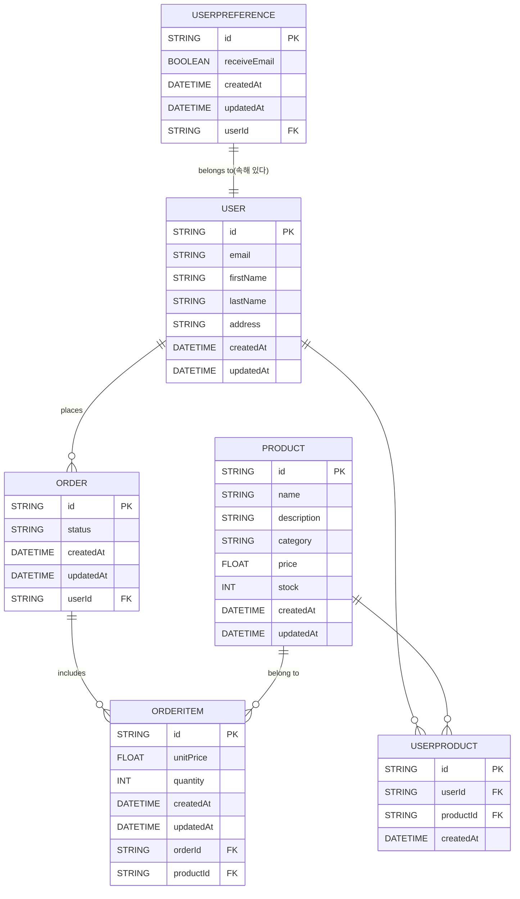

# User, Product, Order

```mermaid
  erDiagram
    USER {
        STRING id PK
        STRING email
        STRING firstName
        STRING lastName
        STRING address
        DATETIME createdAt
        DATETIME updatedAt
    }
    PRODUCT {
        STRING id PK
        STRING name
        STRING description
        STRING category
        FLOAT price
        INT stock
        DATETIME createdAt
        DATETIME updatedAt
    }
    USERPRODUCT {
        STRING id PK
        STRING userId FK
        STRING productId FK
        DATETIME createdAt
    }
    ORDER {
        STRING id PK
        STRING status
        DATETIME createdAt
        DATETIME updatedAt
        STRING userId FK
    }
    ORDERITEM {
        STRING id PK
        FLOAT unitPrice
        INT quantity
        DATETIME createdAt
        DATETIME updatedAt
        STRING orderId FK
        STRING productId FK
    }
    USERPREFERENCE {
        STRING id PK
        BOOLEAN receiveEmail
        DATETIME createdAt
        DATETIME updatedAt
        STRING userId FK
    }

    USER ||--o{ ORDER : "places"
    ORDER ||--o{ ORDERITEM : "includes"
    PRODUCT ||--o{ ORDERITEM : "belong to"
    USER ||--o{ USERPRODUCT : ""
    PRODUCT ||--o{ USERPRODUCT : ""
    USERPREFERENCE ||--|| USER: "belongs to(속해 있다)"
```
